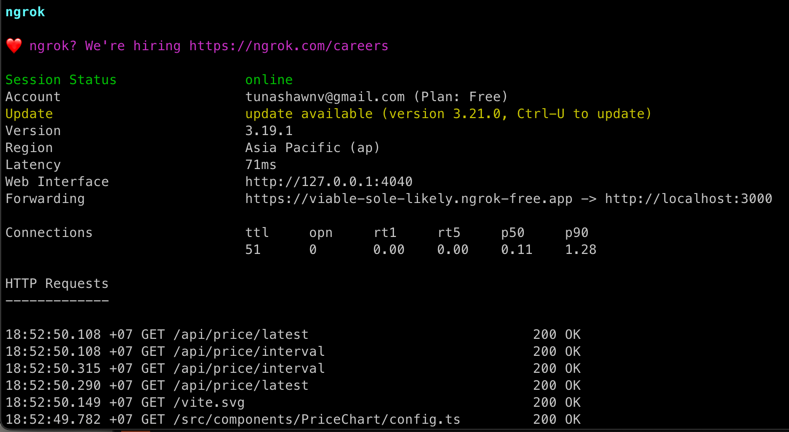
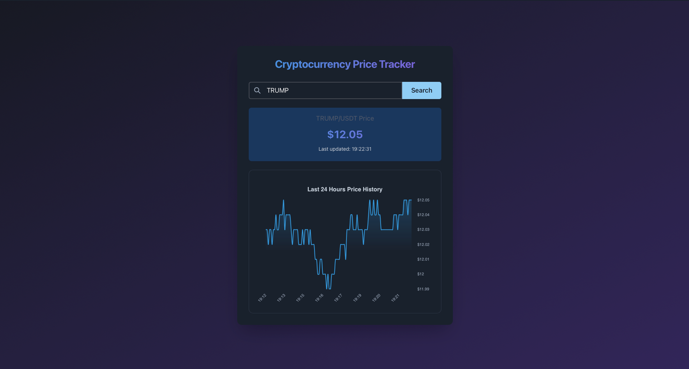
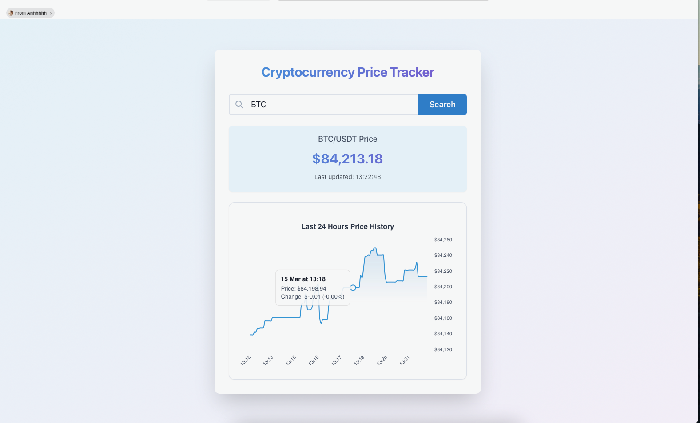

## Purpose
This project is an assignment for one of my interview. It asks
for a simple website to track a single cryptocurrency price.

## Tech stack
Go, Vite, Sqlite, caching using mem-cache, docker, docker compose

## How to run
Make sure your computer installed docker and docker compose.
Then run the following commands:

`docker-compose build
`

`docker-compose up
`

With the containers are running, you can access the website on http://localhost:3000.

**IMPORTANT**: After Go server is running, please wait for the log
"`INFO bulk insert count=...`" appears to let server initialize its data
before access the website.

## How to use
The website is very simple. User input the symbol (example: BTC for Bitcoin) of a coin to get
its latest value in USDT and market price history (history price is only retrieved from sqlite database)

Disclaimer: This project use api from Binance, responses from Binance does not show name of the
crypto but only symbol. For the ease of development, everything in this state will use only symbol
to identify cryptocurrencies.

## Access through internet
In this instruction, I will use ngrok to get a free domain.
It will simply expose a port in your network to the internet.

Follow this instruction: https://ngrok.com/downloads to install ngrok, 
get a free account and get a free random domain in under 3 minutes.

After ngrok is running and bound with your port 3000, just use 
the domain `https://{{random-word}}.ngrok-free.app` displayed on your terminal " to 
access the website over the internet 

## Screenshots

## Future improvement
Because the requirement of this assignment is a about a simple web
application using simple and lightweight databases and caching technique,
it limits what I can do in this version:
* Having the worker deployed independently to fetch data from multiple source
* Using redis instead of mem-cache to read the latest data collected from worker
* Using nginx to route traffics to the scalable server
* Store and display more information of cryptocurrency

With future this design, the server can auto-scale horizontally with the traffic.
